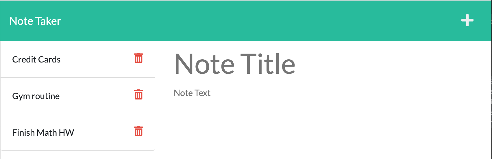
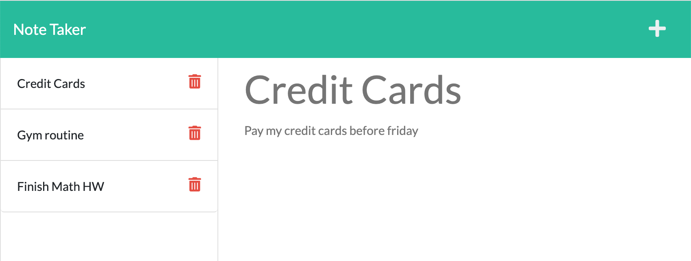

# README Team Profile Generator

  ### 

## Description

This application it´s named Note Taker and can be used to write and save notes about everything you want to remember in the future. The Project was built with help of express.js to simulate a local server where the notes saved goes directly to a data base JSON file.

The way how the app works are the following:

1. When I open the Note Taker then I am presented with a landing page with a link to a notes page.
2. When I click on the link to the notes page then I am presented with a page with existing notes listed in the left-hand column, plus empty fields to enter a new note title and the note’s text in the right-hand column.
3. When I enter a new note title and the note’s text then a Save icon appears in the navigation at the top of the page.
4. When I click on the Save icon then the new note I have entered is saved and appears in the left-hand column with the other existing notes.
5. When I click on an existing note in the list in the left-hand column then that note appears in the right-hand column.
6. When I click on the Write icon in the navigation at the top of the page then I am presented with empty fields to enter a new note title and the note’s text in the right-hand column.

## Table of Contents

  - [Installation](#installation)
  - [Usage](#usage)
  - [License](#license)
  - [Contribution](#contribution)
  - [Tests](#tests)
  - [Questions](#questions)

## Installation

The Package json is already added in this project, so you should only have to to install it in your terminal typing the following 'npm i'.

## Usage

Run this project writing in your terminal 'node server.js' and then answer all the questions prompted to get a Team Profile generated withing 'dist' folder.

## License

### MIT License (https://opensource.org/licenses/MIT)

      MIT License Copyright (c) [year] [fullname]
      
      Permission is hereby granted, free of charge, to any person obtaining a copy
      of this software and associated documentation files (the "Software"), to deal
      in the Software without restriction, including without limitation the rights
      to use, copy, modify, merge, publish, distribute, sublicense, and/or sell
      copies of the Software, and to permit persons to whom the Software is
      furnished to do so, subject to the following conditions:
      
      The above copyright notice and this permission notice shall be included in all
      copies or substantial portions of the Software.
      
      THE SOFTWARE IS PROVIDED "AS IS", WITHOUT WARRANTY OF ANY KIND, EXPRESS OR
      IMPLIED, INCLUDING BUT NOT LIMITED TO THE WARRANTIES OF MERCHANTABILITY,
      FITNESS FOR A PARTICULAR PURPOSE AND NONINFRINGEMENT. IN NO EVENT SHALL THE
      AUTHORS OR COPYRIGHT HOLDERS BE LIABLE FOR ANY CLAIM, DAMAGES OR OTHER
      LIABILITY, WHETHER IN AN ACTION OF CONTRACT, TORT OR OTHERWISE, ARISING FROM,
      OUT OF OR IN CONNECTION WITH THE SOFTWARE OR THE USE OR OTHER DEALINGS IN THE
      SOFTWARE.

## Contribution

Jorge Cardenas.

## Tests

No tests.

## Questions

My GitHub: https://github.com/Jorgecdl96

You can send an e-mail to Jorgecdl96@gmail.com for any additional question.

## App Deployed

URL Link: https://secret-eyrie-33204.herokuapp.com

